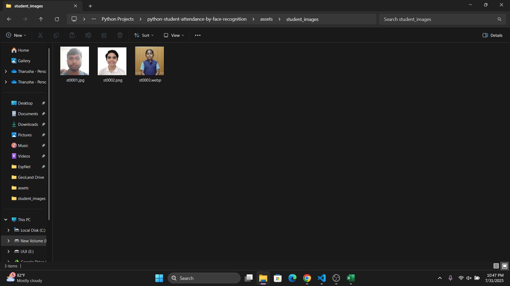

# Live Student Attendance by Face Recognition

This project facilitates live student attendance using face recognition technology.

## Features

* Real-time face recognition with visual student identification via drawn rectangles.
* Graphical User Interface (GUI).
* Automatic creation of daily Excel files for attendance records.

## Installation

1. Clone the repository:

   ```bash
   git clone https://github.com/tharushaudana/python-student-attendance-by-face-recognition.git
   cd python-student-attendance-by-face-recognition
   ```

2. Create a virtual environment:

   **Windows:**

   ```bash
   python -m venv env
   .\env\Scripts\activate
   ```

   **Linux/macOS:**

   ```bash
   python3 -m venv env
   source env/bin/activate
   ```

3. Install `dlib` manually (required for `face_recognition`):

   Visit: [https://github.com/z-mahmud22/Dlib\_Windows\_Python3.x](https://github.com/z-mahmud22/Dlib_Windows_Python3.x)
   Download the `.whl` file compatible with your Python version.

   Example for Python 3.12.1:

   ```bash
   python -m pip install dlib-19.24.99-cp312-cp312-win_amd64.whl
   ```

4. Install remaining dependencies:

   ```bash
   pip install -r requirements.txt
   ```

5. Run the project:

   ```bash
   python main.py
   ```

> ✅ The package versions in `requirements.txt` are fully compatible with **Python 3.12.1**.
> ✅ This project has been tested and confirmed to run successfully using **Python 3.12.1**.

## Instructions

1. **Clone the Repository**

2. **Configure Parameters in `config.py`**

   Modify the following parameters in `config.py` if needed:

   ```python
   video_device_index = 0
   images_path = 'assets/student_images/'
   student_data_path = 'assets/student_data.xlsx'
   attendsheets_dir_path = 'Attend Sheets/'
   ```

3. **Create `student_data.xlsx`**

   Create `student_data.xlsx` in `assets/student_data.xlsx` with student information. Refer to  for the required format.

4. **Store Student Images**

   Store student images in `assets/student_images/`, ensuring filenames correspond to student IDs in `student_data.xlsx`. See  for an example.

5. **Attendance Sheets**

   Attendance sheets are automatically generated daily in `Attend Sheets/`. View  for an example and  for a sample attendance sheet.

6. **Sample Video**

   Watch a demonstration of live recognition in 
